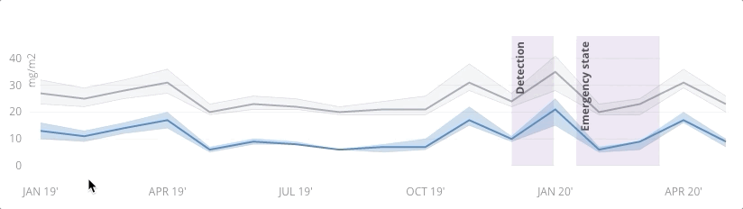
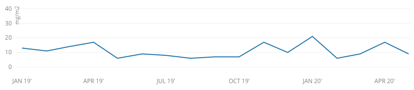
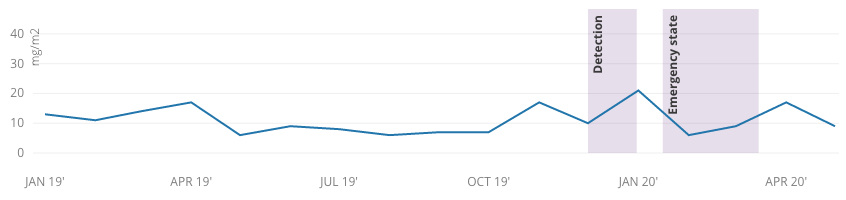
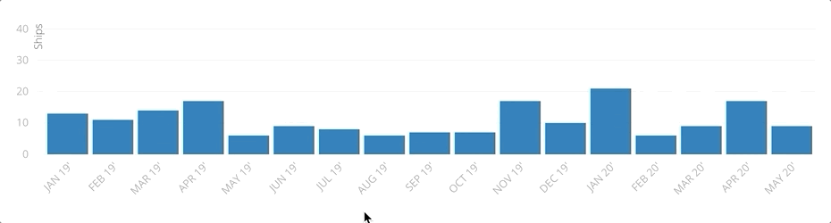

# Data usage

The COVID-19 dashboard supports raster layers in COG format and indicator data for specific spotlight areas. This document outlines how the data can be presented to the user.

# COGs

*Coming soon*

# Indicator data

## Timeseries line chart
The timeseries line chart can be used to plot data over a given time period. It supports a main indicator value and its confidence zone (depicted in blue), a baseline value and its confidence zone, and highlight bands.
The chart is interactive, allowing the user to view the values on hover.

### Trendline - required
As listed in the [Contributing Indicators Data](./indicators.md) document, only the `date` and `indicator` properties are required which will result in a simple chart

### Baseline and confidence intervals - optional
If available in the dataset, the chart will show the confidence region for both the indicator and the baseline as a shaded version of the line color.

### Highlight bands - optional
The highlight bands are useful to call the user's attention to a specific time interval.  
They're defined by providing an interval with a start and end dates and an optional label.

## Bar chart
The bar chart can be used to display discrete values on specific dates, where there's no linear correlation beteween time periods. It will show a bar for each date entry at monthly intervals.  
The chart is interactive, allowing the user to view the values on hover.

### Data
The only required properties for the bar chart arre `date` and `indicator`.
